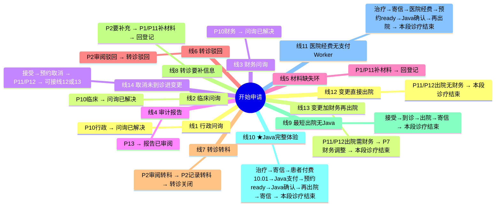

# 完整线路图（按「一条线走到底」）

对照 Tasklist / 流程图上的任务标题填写。  
每一步只写**最影响下一步去哪**的选项；其它字段（病例号、备注等）随便填满必填即可。

病例号建议全程：`DEMO-001`（Java 线可用 `DEMO-JAVA-01`）。

---

## 分工对照（进程 ↔ 线）

| 同学 | 进程 | 对应线 |
|------|------|--------|
| **A** | P5、P7、P8、P13 | 线 4；线 10；线 11（经费段）；线 13 |
| **B** | P3、P4、P6 | 线 9；线 10 / 11（预约与 Java②）；线 14（取消/未到诊） |
| **C** | P1、P2、P9 | 线 5、6、7、8；线 9 / 10 / 11（登记、转诊、寄信） |
| **D** | P10、P11、P12 | 线 1、2、3；线 12；线 14（变更段） |

> 一条线若跨多人进程：各讲自己负责的 P 即可，不必两人同讲一条线。  
> Java：A 主讲线 10 的支付 Java①；B 主讲线 11 的预约确认 Java②。

---

## 总览思维导图（所有完整线路）



---

## 线 1｜P10 行政问询 → 问询已解决

```
开始申请
  → P1 / P10 / P13　登记申请；核验材料与身份
       【选】申请类型 = 行政问询
  → P10　处理行政问询；记录答复
       【选】结果 = 已完成并记录
  → 【终点】问询已解决
```

---

## 线 2｜P10 临床问询 → 问询已解决

```
开始申请
  → P1 / P10 / P13　登记申请；核验材料与身份
       【选】申请类型 = 临床问询
  → P10　专科护士 / 医生答复并记录临床建议
       【选】结果 = 已完成并记录
  → 【终点】问询已解决
```

---

## 线 3｜P10 财务问询 → 问询已解决

```
开始申请
  → P1 / P10 / P13　登记申请；核验材料与身份
       【选】申请类型 = 财务问询
  → P10　财务答复支付 / 经费问询
       【选】结果 = 已完成并记录
  → 【终点】问询已解决
```

---

## 线 4｜P13 审计报告 → 报告已审阅

```
开始申请
  → P1 / P10 / P13　登记申请；核验材料与身份
       【选】申请类型 = 管理审计 / 报告
  → P13　授权管理者审阅审计轨迹与路径报告
       【选】结果 = 已完成并记录
  → 【终点】报告已审阅
```

---

## 线 5｜材料缺失 → 补材料 → 回到登记（不是终点，是环）

```
开始申请
  → P1 / P10 / P13　登记申请；核验材料与身份
       【选】申请类型 = 转诊 - 支持材料缺失
  → P1 / P11　补齐缺失或正式授权材料
       【选】结果 = 已完成并记录
  → 回到 P1 / P10 / P13　登记申请；核验材料与身份
       （在这里再选其它类型，进入其它线）
```

---

## 线 6｜转诊驳回 → 转诊驳回

```
开始申请
  → P1 / P10 / P13　登记申请；核验材料与身份
       【选】申请类型 = 新转诊 - 材料已核验
  → P2　顾问医生审阅转诊；记录决定与理由
       【选】转诊决定 = 驳回
  → 【终点】转诊驳回
```

---

## 线 7｜转诊转科 → 转诊关闭

```
开始申请
  → P1 / P10 / P13　登记申请；核验材料与身份
       【选】申请类型 = 新转诊 - 材料已核验
  → P2　顾问医生审阅转诊；记录决定与理由
       【选】转诊决定 = 转至其他专科
  → P2　记录授权转科并通知转诊方
       【选】结果 = 已完成并记录
  → 【终点】转诊关闭
```

---

## 线 8｜转诊要补充信息 → 补材料 → 回登记（环）

```
开始申请
  → P1 / P10 / P13　登记申请；核验材料与身份
       【选】申请类型 = 新转诊 - 材料已核验
  → P2　顾问医生审阅转诊；记录决定与理由
       【选】转诊决定 = 要求补充信息
  → P1 / P11　补齐缺失或正式授权材料
       【选】结果 = 已完成并记录
  → 回到 P1 / P10 / P13　登记申请
```

---

## 线 9｜最短护理出院（无 Java）→ 本段诊疗结束

```
开始申请
  → P1 / P10 / P13　登记申请；核验材料与身份
       【选】申请类型 = 新转诊 - 材料已核验
  → P2　顾问医生审阅转诊；记录决定与理由
       【选】转诊决定 = 接受
  → P3 / P4 / P12　预约就诊；通知患者；记录到诊 / 联系
       【选】结果 = 已预约、通知且已到诊
  → P5 / P9 / P12　会诊 / 治疗 / 复查；授权护理与门诊信件
       【选】结果 = 授权出院 / 无需继续护理
  → P9　核对并寄送已批准门诊信件
       【选】结果 = 已批准信件已寄出并记录
  → 【终点】本段诊疗结束
```

---

## 线 10｜★ 完整体验 + 两个 Java → 本段诊疗结束

（病例号建议 `DEMO-JAVA-01`；看控制台日志）

```
开始申请
  → P1 / P10 / P13　登记申请；核验材料与身份
       【选】申请类型 = 新转诊 - 材料已核验
  → P2　顾问医生审阅转诊；记录决定与理由
       【选】转诊决定 = 接受
  → P3 / P4 / P12　预约就诊；通知患者；记录到诊 / 联系
       【选】结果 = 已预约、通知且已到诊
  → P5 / P9 / P12　会诊 / 治疗 / 复查；授权护理与门诊信件
       【选】结果 = 授权治疗 / 下一疗程
  → P9　核对并寄送已批准门诊信件
       【选】结果 = 已批准信件已寄出并记录
  → P7　评估经费；记录支付 / 批准状态
       【选】经费结果 = 需要患者付费 - 调用支付方
       【填】收费金额 = 10.01
  → P7　向外部提供方发起支付请求　　← Java ① request-payment（自动，无表单）
  → P6　确认已授权治疗与检查预约
       【选】结果 = 资源可用；预约已确认
  → P6　发送预约确认　　← Java ② send-booking-confirmation（自动，无表单）
  → P5 / P9 / P12　会诊 / 治疗 / 复查；授权护理与门诊信件　　（回来第二次）
       【选】结果 = 授权出院 / 无需继续护理
  → P9　核对并寄送已批准门诊信件
       【选】结果 = 已批准信件已寄出并记录
  → 【终点】本段诊疗结束
```

日志应出现：

```text
request-payment SUCCESS ... amount=10.01
send-booking-confirmation ...
```

---

## 线 11｜医院经费（跳过支付 Java，仍会跑预约确认 Java）→ 本段诊疗结束

```
开始申请
  → P1 / P10 / P13　登记申请；核验材料与身份
       【选】申请类型 = 新转诊 - 材料已核验
  → P2　顾问医生审阅转诊；记录决定与理由
       【选】转诊决定 = 接受
  → P3 / P4 / P12　预约就诊；通知患者；记录到诊 / 联系
       【选】结果 = 已预约、通知且已到诊
  → P5 / P9 / P12　会诊 / 治疗 / 复查；授权护理与门诊信件
       【选】结果 = 授权治疗 / 下一疗程
  → P9　核对并寄送已批准门诊信件
       【选】结果 = 已批准信件已寄出并记录
  → P7　评估经费；记录支付 / 批准状态
       【选】经费结果 = 医院经费已确认　　（不调支付 Worker）
  → P6　确认已授权治疗与检查预约
       【选】结果 = 资源可用；预约已确认
  → P6　发送预约确认　　← 仅 Java ②
  → P5 / P9 / P12　会诊 / 治疗 / 复查……
       【选】结果 = 授权出院 / 无需继续护理
  → P9　核对并寄送已批准门诊信件
       【选】结果 = 已批准信件已寄出并记录
  → 【终点】本段诊疗结束
```

---

## 线 12｜登记进变更 → 无财务出院 → 本段诊疗结束

```
开始申请
  → P1 / P10 / P13　登记申请；核验材料与身份
       【选】申请类型 = 授权变更 / 随访 / 取消
  → P11 / P12　授权变更、随访或取消
       【选】结果 = 授权停止 / 出院 - 无财务影响
  → 【终点】本段诊疗结束
```

---

## 线 13｜登记进变更 → 财务调整 → 出院 → 本段诊疗结束

```
开始申请
  → P1 / P10 / P13　登记申请；核验材料与身份
       【选】申请类型 = 授权变更 / 随访 / 取消
  → P11 / P12　授权变更、随访或取消
       【选】结果 = 授权停止 / 出院 - 需财务复核
  → P7 / P11 / P12　批准并记录退款、转账或留存
       【选】结果 = 财务决定已授权且结果已记录
  → 【终点】本段诊疗结束
```

---

## 线 14｜主路径预约取消 → 进变更（再接线 12 / 13 的后半段）

```
开始申请
  → P1 / P10 / P13　登记申请；核验材料与身份
       【选】申请类型 = 新转诊 - 材料已核验
  → P2　顾问医生审阅转诊；记录决定与理由
       【选】转诊决定 = 接受
  → P3 / P4 / P12　预约就诊；通知患者；记录到诊 / 联系
       【选】结果 = 已取消 / 拒绝 / 未到诊
  → P11 / P12　授权变更、随访或取消
       【选】见下：
            · 授权停止 / 出院 - 无财务影响　→ 终点「本段诊疗结束」
            · 授权停止 / 出院 - 需财务复核　→ P7/P11/P12 财务调整 → 终点
            · 授权随访…　→ 回到预约就诊
            · 授权治疗变更…　→ 进入经费 / 治疗线
```

---

## 建议你实际点的顺序

| 次序 | 跑哪条线 | 你会看到 |
|------|----------|----------|
| 1 | 线 1 | P10 行政问询到终点 |
| 2 | 线 2 | P10 临床问询到终点 |
| 3 | 线 3 | P10 财务问询到终点 |
| 4 | 线 4 | P13 报告到终点 |
| 5 | 线 6 | 转诊驳回终点 |
| 6 | 线 7 | 转科关闭终点 |
| 7 | **线 10** | 主路径 + 两个 Java + 出院（必做） |
| 8 | 线 12 或 13 | 变更线到终点 |

---

## 启动

```bash
cd "Ruby/hospital-pathway-zh-learn"
mvn spring-boot:run
```

Tasklist 用户：`demo`。不要和正式版 `hospital-pathway` 同时开。
