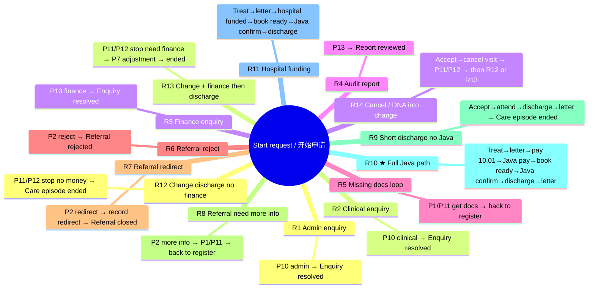

# 完整线路图 / Full path guide（按「一条线走到底」）

对照 Tasklist / 流程图上的任务标题填写。  
Match the task titles in Tasklist / the BPMN diagram.

每一步只写**最影响下一步去哪**的选项；其它字段（病例号、备注等）随便填满必填即可。  
At each step, only the option that **routes the next step** matters; fill other required fields freely.

病例号建议全程：`DEMO-001`（Java 线可用 `DEMO-JAVA-01`）。  
Suggested case ID: `DEMO-001` (use `DEMO-JAVA-01` on the Java path).

中文界面：`Ruby/hospital-pathway-zh-learn`　｜　English UI: `Coursework/hospital-pathway`  
选项中英文对照见下方【选】行（左中 / 右英）。

---

## 分工对照 / Role split（进程 ↔ 线 · Process ↔ Route）

| 同学 Member | 进程 Process | 对应线 Routes |
|-------------|--------------|---------------|
| **A** | P5、P7、P8、P13 | 线 4；线 10；线 11（经费段 / funding）；线 13 |
| **B** | P3、P4、P6 | 线 9；线 10 / 11（预约与 Java② / booking + Java②）；线 14（取消/未到诊） |
| **C** | P1、P2、P9 | 线 5、6、7、8；线 9 / 10 / 11（登记、转诊、寄信） |
| **D** | P10、P11、P12 | 线 1、2、3；线 12；线 14（变更段 / change） |

> 一条线若跨多人进程：各讲自己负责的 P 即可。  
> If a route spans several owners, each person covers only their own P’s.  
> Java：A 主讲线 10 的支付 Java①；B 主讲线 11 的预约确认 Java②。  
> Java: A owns payment Java① on Route 10; B owns booking-confirmation Java② on Route 11.

---

## 总览思维导图 / Overview mind map



---

## 线 1｜P10 行政问询 → 问询已解决  
## Route 1｜P10 Administrative enquiry → Enquiry resolved

```
开始申请 / Start request
  → P1 / P10 / P13　登记申请；核验材料与身份
     Register request; check documents and ID
       【选】申请类型 = 行政问询 / Administrative enquiry
  → P10　处理行政问询；记录答复
     Resolve administrative enquiry; record response
       【选】结果 = 已完成并记录 / Completed and recorded
  → 【终点】问询已解决 / Enquiry resolved
```

---

## 线 2｜P10 临床问询 → 问询已解决  
## Route 2｜P10 Clinical enquiry → Enquiry resolved

```
开始申请 / Start request
  → P1 / P10 / P13　登记申请；核验材料与身份
     Register request; check documents and ID
       【选】申请类型 = 临床问询 / Clinical enquiry
  → P10　专科护士 / 医生答复并记录临床建议
     CNS / clinician responds and records clinical advice
       【选】结果 = 已完成并记录 / Completed and recorded
  → 【终点】问询已解决 / Enquiry resolved
```

---

## 线 3｜P10 财务问询 → 问询已解决  
## Route 3｜P10 Financial enquiry → Enquiry resolved

```
开始申请 / Start request
  → P1 / P10 / P13　登记申请；核验材料与身份
     Register request; check documents and ID
       【选】申请类型 = 财务问询 / Financial enquiry
  → P10　财务答复支付 / 经费问询
     Finance responds to payment / funding enquiry
       【选】结果 = 已完成并记录 / Completed and recorded
  → 【终点】问询已解决 / Enquiry resolved
```

---

## 线 4｜P13 审计报告 → 报告已审阅  
## Route 4｜P13 Audit report → Report reviewed

```
开始申请 / Start request
  → P1 / P10 / P13　登记申请；核验材料与身份
     Register request; check documents and ID
       【选】申请类型 = 管理审计 / 报告 / Management audit / report
  → P13　授权管理者审阅审计轨迹与路径报告
     Authorised manager reviews audit trail and pathway reports
       【选】结果 = 已完成并记录 / Completed and recorded
  → 【终点】报告已审阅 / Report reviewed
```

---

## 线 5｜材料缺失 → 补材料 → 回到登记（环，非终点）  
## Route 5｜Missing documents → obtain records → back to register (loop)

```
开始申请 / Start request
  → P1 / P10 / P13　登记申请；核验材料与身份
     Register request; check documents and ID
       【选】申请类型 = 转诊 - 支持材料缺失 / Referral - supporting documents missing
  → P1 / P11　补齐缺失或正式授权材料
     Obtain missing or formally authorised records
       【选】结果 = 已完成并记录 / Completed and recorded
  → 回到登记 / Back to register
       （再选其它类型，进入其它线 / then pick another type for another route）
```

---

## 线 6｜转诊驳回 → 转诊驳回  
## Route 6｜Referral reject → Referral rejected

```
开始申请 / Start request
  → P1 / P10 / P13　登记申请；核验材料与身份
     Register request; check documents and ID
       【选】申请类型 = 新转诊 - 材料已核验 / New referral - documents checked
  → P2　顾问医生审阅转诊；记录决定与理由
     Consultant reviews referral; records decision and reason
       【选】转诊决定 = 驳回 / Reject
  → 【终点】转诊驳回 / Referral rejected
```

---

## 线 7｜转诊转科 → 转诊关闭  
## Route 7｜Referral redirect → Referral closed

```
开始申请 / Start request
  → P1 / P10 / P13　登记申请；核验材料与身份
     Register request; check documents and ID
       【选】申请类型 = 新转诊 - 材料已核验 / New referral - documents checked
  → P2　顾问医生审阅转诊；记录决定与理由
     Consultant reviews referral; records decision and reason
       【选】转诊决定 = 转至其他专科 / Redirect to another specialty
  → P2　记录授权转科并通知转诊方
     Record authorised redirect and notify referrer
       【选】结果 = 已完成并记录 / Completed and recorded
  → 【终点】转诊关闭 / Referral closed
```

---

## 线 8｜转诊要补充信息 → 补材料 → 回登记（环）  
## Route 8｜Request more information → obtain records → back to register

```
开始申请 / Start request
  → P1 / P10 / P13　登记申请；核验材料与身份
     Register request; check documents and ID
       【选】申请类型 = 新转诊 - 材料已核验 / New referral - documents checked
  → P2　顾问医生审阅转诊；记录决定与理由
     Consultant reviews referral; records decision and reason
       【选】转诊决定 = 要求补充信息 / Request more information
  → P1 / P11　补齐缺失或正式授权材料
     Obtain missing or formally authorised records
       【选】结果 = 已完成并记录 / Completed and recorded
  → 回到登记 / Back to register
```

---

## 线 9｜最短护理出院（无 Java）→ 本段诊疗结束  
## Route 9｜Shortest care discharge (no Java) → Care episode ended

```
开始申请 / Start request
  → P1 / P10 / P13　登记申请；核验材料与身份
     Register request; check documents and ID
       【选】申请类型 = 新转诊 - 材料已核验 / New referral - documents checked
  → P2　顾问医生审阅转诊；记录决定与理由
     Consultant reviews referral; records decision and reason
       【选】转诊决定 = 接受 / Accept
  → P3 / P4 / P12　预约就诊；通知患者；记录到诊 / 联系
     Book visit; notify patient; record attendance / contact
       【选】结果 = 已预约、通知且已到诊 / Booked, notified and attended
  → P5 / P9 / P12　会诊 / 治疗 / 复查；授权护理与门诊信件
     Consult / treat / review; authorise care and clinic letter
       【选】结果 = 授权出院 / 无需继续护理 / Authorise discharge / no further care
  → P9　核对并寄送已批准门诊信件
     Check and dispatch approved clinic letter
       【选】结果 = 已批准信件已寄出并记录 / Approved letter sent and recorded
  → 【终点】本段诊疗结束 / Care episode ended
```

---

## 线 10｜★ 完整体验 + 两个 Java → 本段诊疗结束  
## Route 10｜★ Full path + both Java workers → Care episode ended

（病例号建议 `DEMO-JAVA-01`；看控制台日志 / use case ID `DEMO-JAVA-01`; watch console logs）

```
开始申请 / Start request
  → P1 / P10 / P13　登记申请；核验材料与身份
     Register request; check documents and ID
       【选】申请类型 = 新转诊 - 材料已核验 / New referral - documents checked
  → P2　顾问医生审阅转诊；记录决定与理由
     Consultant reviews referral; records decision and reason
       【选】转诊决定 = 接受 / Accept
  → P3 / P4 / P12　预约就诊；通知患者；记录到诊 / 联系
     Book visit; notify patient; record attendance / contact
       【选】结果 = 已预约、通知且已到诊 / Booked, notified and attended
  → P5 / P9 / P12　会诊 / 治疗 / 复查；授权护理与门诊信件
     Consult / treat / review; authorise care and clinic letter
       【选】结果 = 授权治疗 / 下一疗程 / Authorise treatment / next cycle
  → P9　核对并寄送已批准门诊信件
     Check and dispatch approved clinic letter
       【选】结果 = 已批准信件已寄出并记录 / Approved letter sent and recorded
  → P7　评估经费；记录支付 / 批准状态
     Assess funding; record payment / approval status
       【选】经费结果 = 需要患者付费 - 调用支付方
                / Patient payment required - call provider
       【填】收费金额 = 10.01 / Charge amount = 10.01
  → P7　向外部提供方发起支付请求
     Request payment from external provider
       ← Java ① request-payment（自动，无表单 / automatic, no form）
  → P6　确认已授权治疗与检查预约
     Confirm authorised treatment and investigation appointments
       【选】结果 = 资源可用；预约已确认 / Resources available; booking confirmed
  → P6　发送预约确认
     Send booking confirmation
       ← Java ② send-booking-confirmation（自动 / automatic）
  → P5 / P9 / P12　会诊 / 治疗 / 复查……（第二次 / second pass）
       【选】结果 = 授权出院 / 无需继续护理 / Authorise discharge / no further care
  → P9　核对并寄送已批准门诊信件
     Check and dispatch approved clinic letter
       【选】结果 = 已批准信件已寄出并记录 / Approved letter sent and recorded
  → 【终点】本段诊疗结束 / Care episode ended
```

日志应出现 / Expected logs:

```text
request-payment SUCCESS ... amount=10.01
send-booking-confirmation ...
```

---

## 线 11｜医院经费（跳过支付 Java，仍跑预约确认 Java）→ 本段诊疗结束  
## Route 11｜Hospital funding (skip payment Java; still runs booking Java) → Care episode ended

```
开始申请 / Start request
  → P1 / P10 / P13　登记申请；核验材料与身份
     Register request; check documents and ID
       【选】申请类型 = 新转诊 - 材料已核验 / New referral - documents checked
  → P2　顾问医生审阅转诊；记录决定与理由
     Consultant reviews referral; records decision and reason
       【选】转诊决定 = 接受 / Accept
  → P3 / P4 / P12　预约就诊；通知患者；记录到诊 / 联系
     Book visit; notify patient; record attendance / contact
       【选】结果 = 已预约、通知且已到诊 / Booked, notified and attended
  → P5 / P9 / P12　会诊 / 治疗 / 复查；授权护理与门诊信件
     Consult / treat / review; authorise care and clinic letter
       【选】结果 = 授权治疗 / 下一疗程 / Authorise treatment / next cycle
  → P9　核对并寄送已批准门诊信件
     Check and dispatch approved clinic letter
       【选】结果 = 已批准信件已寄出并记录 / Approved letter sent and recorded
  → P7　评估经费；记录支付 / 批准状态
     Assess funding; record payment / approval status
       【选】经费结果 = 医院经费已确认 / Hospital funding confirmed
          （不调支付 Worker / does not call payment worker）
  → P6　确认已授权治疗与检查预约
     Confirm authorised treatment and investigation appointments
       【选】结果 = 资源可用；预约已确认 / Resources available; booking confirmed
  → P6　发送预约确认　　← 仅 Java ② / Java ② only
     Send booking confirmation
  → P5 / P9 / P12　会诊 / 治疗 / 复查……
       【选】结果 = 授权出院 / 无需继续护理 / Authorise discharge / no further care
  → P9　核对并寄送已批准门诊信件
     Check and dispatch approved clinic letter
       【选】结果 = 已批准信件已寄出并记录 / Approved letter sent and recorded
  → 【终点】本段诊疗结束 / Care episode ended
```

---

## 线 12｜登记进变更 → 无财务出院 → 本段诊疗结束  
## Route 12｜Register into change → discharge without finance → Care episode ended

```
开始申请 / Start request
  → P1 / P10 / P13　登记申请；核验材料与身份
     Register request; check documents and ID
       【选】申请类型 = 授权变更 / 随访 / 取消
                / Authorised change / follow-up / cancellation
  → P11 / P12　授权变更、随访或取消
     Authorise modification, follow-up or cancellation
       【选】结果 = 授权停止 / 出院 - 无财务影响
                / Authorise stop / discharge - no financial impact
  → 【终点】本段诊疗结束 / Care episode ended
```

---

## 线 13｜登记进变更 → 财务调整 → 出院 → 本段诊疗结束  
## Route 13｜Register into change → finance adjustment → discharge → Care episode ended

```
开始申请 / Start request
  → P1 / P10 / P13　登记申请；核验材料与身份
     Register request; check documents and ID
       【选】申请类型 = 授权变更 / 随访 / 取消
                / Authorised change / follow-up / cancellation
  → P11 / P12　授权变更、随访或取消
     Authorise modification, follow-up or cancellation
       【选】结果 = 授权停止 / 出院 - 需财务复核
                / Authorise stop / discharge - Finance review required
  → P7 / P11 / P12　批准并记录退款、转账或留存
     Approve and record refund, payment transfer or retention
       【选】结果 = 财务决定已授权且结果已记录
                / Financial decision authorised and outcome recorded
  → 【终点】本段诊疗结束 / Care episode ended
```

---

## 线 14｜主路径预约取消 → 进变更（再接线 12 / 13 后半段）  
## Route 14｜Main-path cancel / DNA → change (then Route 12 / 13 tail)

```
开始申请 / Start request
  → P1 / P10 / P13　登记申请；核验材料与身份
     Register request; check documents and ID
       【选】申请类型 = 新转诊 - 材料已核验 / New referral - documents checked
  → P2　顾问医生审阅转诊；记录决定与理由
     Consultant reviews referral; records decision and reason
       【选】转诊决定 = 接受 / Accept
  → P3 / P4 / P12　预约就诊；通知患者；记录到诊 / 联系
     Book visit; notify patient; record attendance / contact
       【选】结果 = 已取消 / 拒绝 / 未到诊 / Cancelled / declined / did not attend
  → P11 / P12　授权变更、随访或取消
     Authorise modification, follow-up or cancellation
       【选】见下 / then choose:
            · 授权停止 / 出院 - 无财务影响
              Authorise stop / discharge - no financial impact
              → 终点 Care episode ended
            · 授权停止 / 出院 - 需财务复核
              Authorise stop / discharge - Finance review required
              → P7 财务调整 / finance adjustment → 终点
            · 授权随访… / Authorise follow-up…
              → 回到预约就诊 / back to book visit
            · 授权治疗变更… / Authorise treatment change…
              → 进入经费 / 治疗线 / funding & treatment path
```

---

## 建议实际点的顺序 / Suggested run order

| 次序 # | 跑哪条线 Route | 你会看到 What you see |
|--------|----------------|------------------------|
| 1 | 线 1 / R1 | P10 行政问询到终点 / Admin enquiry end |
| 2 | 线 2 / R2 | P10 临床问询到终点 / Clinical enquiry end |
| 3 | 线 3 / R3 | P10 财务问询到终点 / Finance enquiry end |
| 4 | 线 4 / R4 | P13 报告到终点 / Report reviewed |
| 5 | 线 6 / R6 | 转诊驳回 / Referral rejected |
| 6 | 线 7 / R7 | 转科关闭 / Referral closed |
| 7 | **线 10 / R10** | 主路径 + 两个 Java + 出院（必做） / Main path + both Java + discharge (**must do**) |
| 8 | 线 12 或 13 / R12 or R13 | 变更线到终点 / Change path to end |

---

## 启动 / Start

中文学习版 / Chinese learn copy:

```bash
cd "Ruby/hospital-pathway-zh-learn"
mvn spring-boot:run
```

正式英文版 / Formal English copy:

```bash
cd "Coursework/hospital-pathway"
mvn spring-boot:run
```

Tasklist 用户 / user：`demo`。  
不要同时开两套工程 / Do not run both projects at the same time.
